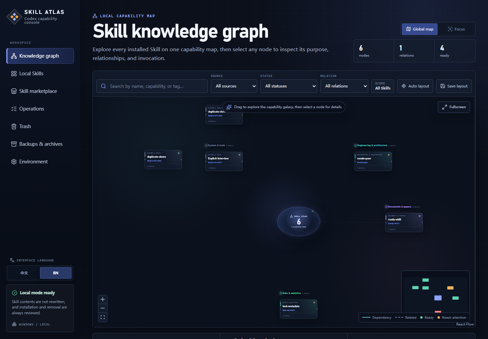

# Skill Atlas

[简体中文](README.zh-CN.md)

**Know which Codex Skill to use, why it fits, and how to invoke it.**

[](https://github.com/NaCr05/skill-atlas/actions/workflows/ci.yml)
[](LICENSE)


Skill Atlas is a Windows-first, local control panel for discovering, understanding, safely installing, and managing the Codex Skills on your computer. It turns a growing collection of Skill folders into a searchable workspace with practical invocation Prompts, readiness checks, relationships, review-before-write lifecycle controls, and optional on-demand AI assistance.



## Why Skill Atlas?

As your Skill collection grows, remembering every Skill's purpose, trigger rules, dependencies, and source becomes difficult. Skill Atlas keeps those details visible and helps you move from “What should I use?” to a copyable Prompt without editing the installed Skill itself.

| Need | What Skill Atlas provides |
| --- | --- |
| Find the right Skill | Search by name, capability, tag, or describe a task in natural language; recent task and marketplace results survive navigation. |
| Know whether it works | Separate structural validity, invocation policy, and environment readiness. |
| Invoke it correctly | Generate an editable Prompt in the selected interface language. |
| Build a personal workspace | Favorite, pin, annotate, and revisit recently copied Skills. |
| Understand provenance | Inspect source folders, supporting files, dependencies, and related Skills. |
| Read a consistent bilingual inventory | Keep Skill names unchanged while showing catalog-backed or deterministic local Chinese summaries, with original `SKILL.md` content always available for verification. |
| Check for changes safely | Compare a personal Skill with its exact GitHub source, file by file, without replacing anything. |
| Discover new Skills | Search SkillsMP and skills.sh from a task, exclude installed entries, and review a complete GitHub Skill tree before installation. |
| Resolve inventory issues | Review duplicate migrations and missing dependencies individually; dependency installs trigger an automatic rescan with a resolved/remaining result. |
| Track and apply upstream changes | Check every source-tracked personal Skill, select entries with updates, then review each fresh diff and update sequentially. |
| Manage duplicate archives | See every compatibility-entry archive, restore it to its original location, or permanently purge it after a fresh exact-name review. |
| Follow write operations | Receive live running/success/failure/interruption updates through the Operations Center, with related recovery links. |
| Audit each mutation | Open a phase timeline for preflight, download, backup, replacement, verification, rollback, and completion. |
| Govern sources | Maintain trusted authors/repositories and license policy; filter by source lock, trust, and archived status. |
| Manage private storage | Inspect update backups, disabled Skills, and duplicate archives by path and size, then restore or review a safe cleanup. |
| Manage the full lifecycle | Disable and re-enable personal Skills, move them to a recoverable trash, restore them in place, or permanently delete one item after a fresh exact-name review. |
| Move to another computer | Export and review-import preferences, notes, history, operations, source registry, and non-secret settings. API keys are excluded. |
| Ask for deeper guidance | Explicitly call AI for installed-Skill matching, market-candidate ranking, Skill composition, review explanation, update summaries, or personal usage suggestions. |

## Quick start

### Windows installer (no command line)

The repository now includes a Windows installer pipeline. When a GitHub Release contains a `Skill-Atlas-Setup-*.exe` asset, download and run it, then open **Skill Atlas** from the Start menu or its optional desktop shortcut. The installer bundles its own Node.js runtime. If the current release has no installer asset, use the source launcher below. See [Windows distribution](docs/windows-distribution.md) for build and release details.

### Run from source

Requirements: Windows 10/11 and Node.js 20 or newer (npm is included).

Clone the project, enter its directory, and use the launcher for your terminal.

```text
git clone https://github.com/NaCr05/skill-atlas.git
cd skill-atlas
```

Command Prompt (CMD):

```bat
start-skill-atlas.cmd
```

PowerShell:

```powershell
.\start-skill-atlas.ps1
```

The launcher checks the project directory, Node.js, npm, dependencies, and local port. If dependencies are missing, run the exact repair command it prints (`npm ci` or `npm.cmd ci`) and launch again. It automatically selects a free port and opens the browser when the server is ready.

Then:

1. Select **Rescan** to read the current local inventory.
2. Describe a task or search for a Skill.
3. Open a result, review its rules, and select **Copy invocation Prompt**.
4. Paste the Prompt into Codex and add the details of your task.

For terminal identification, missing-Node repair, PowerShell execution policy, manual startup, diagnostics, and production mode, see the [complete quick-start guide](docs/quick-start.md).

## What it scans

Skill Atlas treats the filesystem as the source of truth and recognizes:

- personal Skills in `%CODEX_HOME%\skills` or `%USERPROFILE%\.codex\skills`;
- Codex system Skills under `.system`;
- the currently active version of plugin-provided Skills;
- compatible `.agents` and skill-manager shared directories as read-only sources.

Stale plugin-cache releases are hidden. Compatibility and shared directories remain read-only. Catalog descriptions, deterministic local summaries, and AI output are never written back to an installed `SKILL.md`. Unknown English Skills receive a clearly labeled local Chinese summary; suspicious text encoding is reported instead of being presented as trusted metadata.

## Optional integrations

The local inventory, task recommendation, and default Prompt flow require no API key. AI enhancement can be configured directly in **Environment → AI connection console**: select a provider, enter its model and API key, and save. It takes effect immediately and survives refreshes and restarts. Keys are encrypted for the current Windows user with DPAPI and are never returned to the page after saving.

External models are strictly on demand. Loading a page, typing, searching, scanning, and using local recommendation do not call a provider. Marketplace search and AI ranking are also separate actions: search first returns grounded uninstalled candidates, then an optional AI button ranks only those exact results. Other separate buttons enable AI task matching, multi-Skill composition, installation-review explanation, update-difference summaries, and personal usage advice. See [On-demand AI assistance](docs/ai-assistance.md) for the exact data and failure boundaries.

Environment variables remain available for advanced setup and recovery. Copy `.env.example` to `.env.local` only when you want that configuration path.

| Variable | Purpose | Required? |
| --- | --- | --- |
| `SKILLSMP_API_KEY` | Higher SkillsMP search quota | No |
| `VERCEL_OIDC_TOKEN` | Official skills.sh API access | No |
| `GITHUB_TOKEN` | Higher GitHub API limits for public repositories | No |
| `AI_PROVIDER` | Select `auto`, `openai`, or `deepseek`; defaults to `auto` | No |
| `OPENAI_API_KEY` and `OPENAI_MODEL` | Enhance Prompts with OpenAI | No |
| `DEEPSEEK_API_KEY` and `DEEPSEEK_MODEL` | Enhance Prompts with DeepSeek | No |

Settings saved in the page take precedence over environment variables; **Restore environment settings** removes the page-managed configuration. `auto` prefers a complete OpenAI configuration, then a complete DeepSeek configuration. If the selected provider is missing or its request fails, Skill Atlas keeps the deterministic local Prompt; it does not silently switch providers at request time. Never commit `.env.local` or paste secrets into personal notes.

## Safety and privacy

- The app binds to `127.0.0.1` by default and has no user account or cloud sync.
- A GitHub-hosted Skill is inspected before installation, including its full file tree, scripts, metadata, size, and blocking risks.
- Installation review also shows repository owner, latest commit, license, activity signals, a version summary, and the exact repository/ref/revision/fingerprint lock used by confirmation.
- Installation requires confirmation, targets only the resolved Codex Skills directory, refuses overwrites, and never executes downloaded scripts.
- Personal Skills can compare with an exact GitHub source and apply a reviewed update through private staging, verified backup, atomic replacement, and automatic rollback. Provenance is stored outside the Skill.
- Personal manageable Skills can be moved into a private Skill Atlas trash after deterministic review and human confirmation. The complete directory, fingerprint, and provenance remain recoverable; restore refuses to overwrite an occupied target.
- Personal manageable Skills can be disabled into a private area outside Codex discovery and re-enabled at the original location after fingerprint and collision checks.
- The dedicated Trash page shows the original and current storage paths, supports one-click restore, and allows per-Skill permanent deletion only after a fresh deterministic review and exact-name confirmation.
- System, plugin, compatibility, and shared Skills remain read-only. Automatic, bulk, and scheduled trash cleanup are not available.
- Favorites, notes, recent copies, task/search history snapshots, and lightweight usage metrics stay in browser-local storage.
- Reopening a task or marketplace result from history never repeats an AI or marketplace request automatically.
- The personal AI assistant sends Skill IDs and bounded usage aggregates only after a click; personal note bodies are never sent.
- Market candidates are labeled **Not installed**, cannot be invoked or composed, and open the same deterministic review checkpoint as marketplace results. Installation still requires a separate human confirmation.
- After a verified installation, the success panel can focus the new Skill in the local inventory or copy its deterministic invocation Prompt immediately.
- Batch issue selection never mutates files. Every duplicate compatibility-entry migration has its own fresh, one-use review and moves the complete directory into a private archive. Archived entries can be restored in place or permanently purged only through a separate exact-name review.
- Dependency repair remains an explicit marketplace review and installation. After a successful install, Skill Atlas forces a fresh inventory scan and reports either **resolved** or the dependencies that still remain.
- Batch upstream checking is read-only and limited to three concurrent source inspections. A separate update queue refreshes and displays each diff, then requires confirmation before every sequential atomic update.
- The Operations Center streams bounded local operation evidence from `CODEX_HOME/.skill-atlas`, marks records left running by a previous process as interrupted, and links them to the relevant recovery surface.

Read the [security model](docs/security-model.md) before changing filesystem or installer behavior. Report vulnerabilities through the process in [SECURITY.md](SECURITY.md).

## Development

```powershell
npm run typecheck
npm run lint
npm run test
npm run build
npm run test:e2e
```

Useful project guides:

- [Quick start](docs/quick-start.md)
- [Architecture](docs/architecture.md)
- [Skill lifecycle](docs/skill-lifecycle.md)
- [Development workflow](docs/development.md)
- [Security model](docs/security-model.md)
- [Testing strategy](docs/testing.md)
- [Contributing](CONTRIBUTING.md)

## Current scope

The current version focuses on Codex and Windows. It can batch-check tracked upstream sources, run a sequential item-by-item update review queue, build a review queue for duplicates and missing dependencies, archive/restore/individually purge approved compatibility duplicates, verify dependency repair after an explicit installation, disable/re-enable personal Skills, recoverably remove/restore them, permanently delete an individually reviewed trash record, and repair a narrow set of revalidated lifecycle failures. It does not silently update Skills, bulk-delete, auto-install dependencies, run Skill scripts, execute Codex automatically, synchronize data to the cloud, or manage user accounts. Claude-compatible sources and macOS support are possible future directions, not current guarantees.

## Contributing and license

Issues and pull requests are welcome. Please read [CONTRIBUTING.md](CONTRIBUTING.md) before proposing a change.

Released under the [MIT License](LICENSE). Copyright © 2026 NaCr05.
