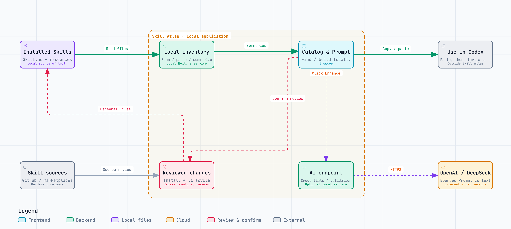
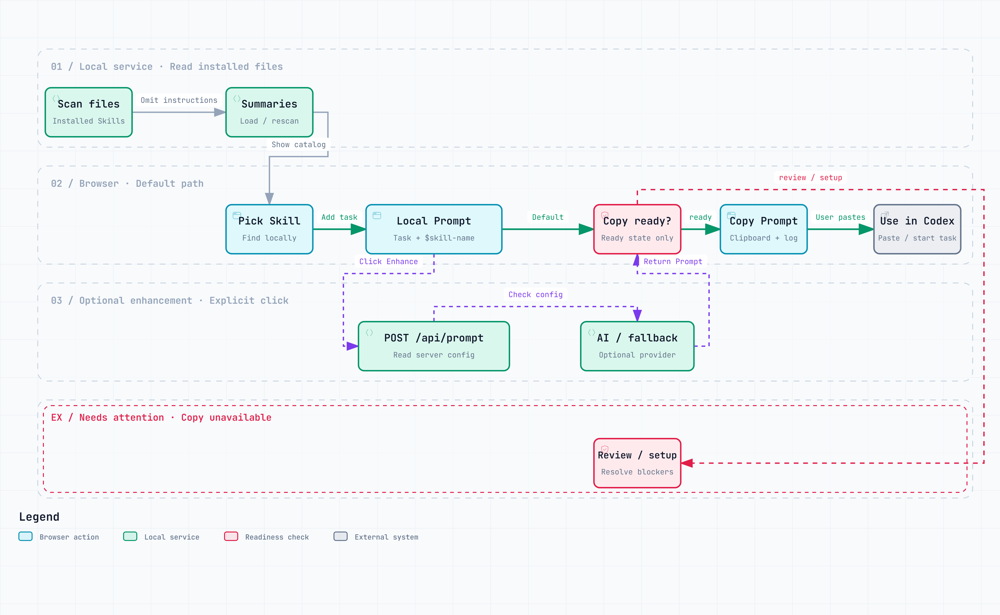
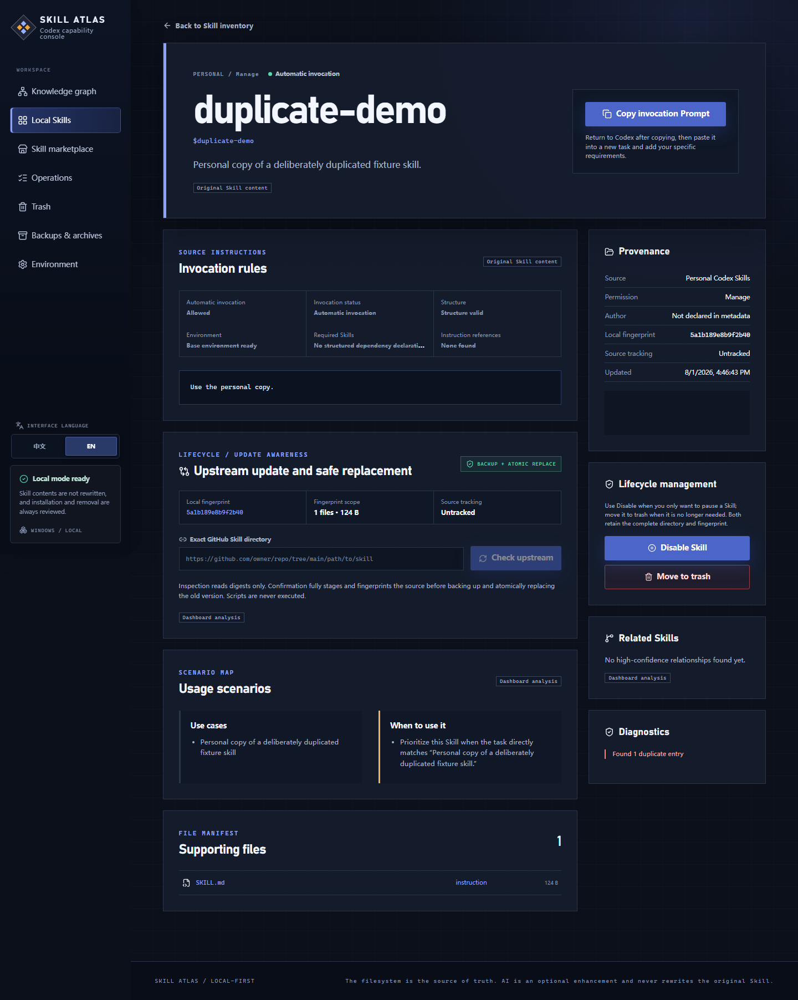
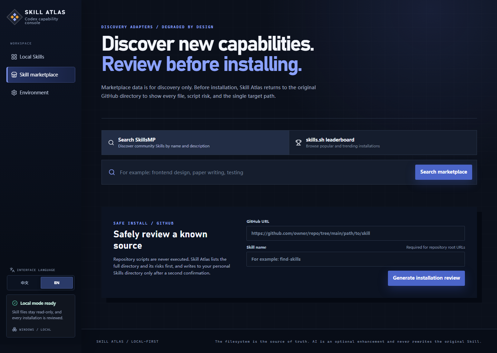
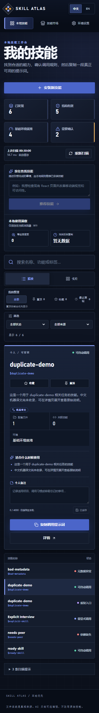

# Skill Atlas

[简体中文](README.zh-CN.md)

**Know which Codex Skill to use, why it fits, and how to invoke it.**

[](https://github.com/NaCr05/skill-atlas/actions/workflows/ci.yml)
[](https://github.com/NaCr05/skill-atlas/releases/tag/v0.2.0)
[](LICENSE)


Skill Atlas is a Windows-first, local control panel for discovering, understanding, safely installing, and managing the Codex Skills on your computer. It turns a growing collection of Skill folders into a searchable workspace with practical invocation Prompts, readiness checks, relationships, review-before-write lifecycle controls, and optional on-demand AI assistance.


[Download the Windows installer](https://github.com/NaCr05/skill-atlas/releases/tag/v0.2.0) · [Start from source](#quick-start) · [Architecture](docs/architecture.md) · [Contribute](CONTRIBUTING.md)

## Try the core workflow

1. **Find** an installed Skill by name or task.
2. **Choose** a Skill and check its readiness and invocation rules.
3. **Describe** your task and edit the locally generated Prompt.
4. **Copy** the Prompt, paste it into Codex, and start the task there.

This path needs no API key. AI enhancement and marketplace discovery each require an explicit click. **Ready** Skills can be copied; **Needs review** and **Needs setup** explain what must be resolved first.

## Architecture at a glance

<picture>
  <source media="(prefers-color-scheme: dark)" srcset="artifacts/diagrams/overview.en.dark.png">
  
</picture>

[View full-size SVG](artifacts/diagrams/overview.en.svg)

The browser handles local matching and default Prompt generation. The local service reads installed files and applies reviewed changes. External services are optional; Skill Atlas hands off a Prompt for the user to run in Codex. See the [architecture and data boundaries](docs/architecture.md).

<details>
<summary><b>Key flow: from discovery to a copyable Prompt</b></summary>

<picture>
  <source media="(prefers-color-scheme: dark)" srcset="artifacts/diagrams/invocation.en.dark.png">
  
</picture>

[View full-size SVG](artifacts/diagrams/invocation.en.svg)

The default path stays local. Copying and AI enhancement both require a ready Skill. The optional AI branch validates the response and falls back to the base Prompt when necessary. Copying ends the Skill Atlas flow; it does not execute a Codex task. [Follow the flow in the source](docs/diagrams/README.md#source-evidence).

</details>

## Capabilities and evidence

| Capability | Current behavior | Where to verify it |
| --- | --- | --- |
| Find and invoke | Local matching and bilingual Prompt generation work without a model key. | [Prompt tests](tests/unit/prompt.test.ts), [explicit AI actions](tests/e2e/ai-assist.spec.ts) |
| Optional AI | Enhancement validates the trigger and language, keeps a local fallback, and never silently retries another provider. | [Prompt implementation](src/core/skills/prompt.ts), [failure cases](tests/unit/prompt.test.ts) |
| Bounded catalog | At most 20 results render per page; 500/1,000-summary fixtures exercise local search and ranking. | [Scale benchmarks](tests/performance/catalog-scale.test.ts), [testing scope](docs/testing.md) |
| Review and recover | Installation and lifecycle changes use their own review and confirmation boundaries. | [Security model](docs/security-model.md), [lifecycle guide](docs/skill-lifecycle.md) |
| Reuse locally | Save recipes, compose ordered 2–8 Skill workflows, and record post-copy feedback locally. | [Personal library](src/core/personal-library.ts), [local feedback model](docs/architecture.md#local-feedback-loop) |
| Windows verification | CI runs type, lint, unit/integration, build, and browser checks. | [CI workflow](.github/workflows/ci.yml), [current runs](https://github.com/NaCr05/skill-atlas/actions/workflows/ci.yml) |

These links describe implemented behavior and verification scope; they do not measure model quality or a speedup.

<details>
<summary><b>Catalog layout, readiness, recipes, and feedback</b></summary>

The home page is now the Skill catalog rather than a statistics dashboard. A single **Find a Skill** command accepts an exact name or a task description. Local matching is immediate; AI deep matching and marketplace discovery each require a separate explicit click before any external request is made.

On desktop, the workspace is organized as **filters → results → invocation Builder**. No Skill is selected by default: the Builder appears only after an explicit choice, keeps its content independently scrollable, and keeps **Copy invocation Prompt** visible at the bottom. The catalog renders at most 20 matching Skills per page so 500- and 1,000-Skill inventories remain bounded. Tablets use a compact navigation menu and move the Builder into a right drawer; phones collapse secondary usage insights and use a bottom sheet with trapped keyboard focus, Escape dismissal, and focus restoration. Favorites, pins, and recent copies organize the catalog; personal notes sit below the list; updates, disablement, and removal remain on the full detail and management surfaces.

Health filters use three action-oriented buckets: **Ready** can generate and copy a Prompt, **Needs review** has an entry or metadata issue, and **Needs setup** is missing a structured dependency or environment condition. The knowledge graph remains available from navigation but no longer occupies the default route.

The Builder's compact **Capability imprint** summarizes source and author, structure, environment, invocation mode, dependencies, recent use, and the active recommendation reason. After adding a task and custom requirements, you can save the result as a local Prompt recipe. Copying a Prompt unlocks **Helpful / Not solved / Wrong Skill** feedback; deterministic ranking uses only these local aggregates and never stores or uploads conversation text. The **Recipes & flows** workspace reuses recipes directly and lets you save, reorder, and copy multi-Skill workflows. This first workflow stage only generates a combined Prompt and never executes Codex automatically.

</details>

<details>
<summary><b>More product views: inspect, install, and use on smaller screens</b></summary>

<table>
  <tr>
    <td width="50%" valign="top">
      <br>
      <sub><b>Inspect a Skill</b> — verify its source, readiness, dependencies, and invocation guidance.</sub>
    </td>
    <td width="50%" valign="top">
      <br>
      <sub><b>Discover safely</b> — compare marketplace candidates and review the complete Skill tree before installation.</sub>
    </td>
  </tr>
  <tr>
    <td colspan="2" align="center">
      <br>
      <sub><b>Use it anywhere</b> — the catalog and invocation workflow adapt to phone-sized screens.</sub>
    </td>
  </tr>
</table>

</details>

## Quick start

### Regular users: download the Windows installer

No Git, Node.js, or command line is required. Open the [v0.2.0 Release](https://github.com/NaCr05/skill-atlas/releases/tag/v0.2.0), download and run `Skill-Atlas-Setup-0.2.0.exe`, then open **Skill Atlas** from the Start menu or the optional desktop shortcut. The installer bundles its own runtime. A newer installer can upgrade the app in place without removing personal Skills or `.skill-atlas` data. See [Windows distribution](docs/windows-distribution.md) for build and release details.

### Developers: first installation from source

Requirements: Windows 10/11, Git, and Node.js 20 or newer (npm is included with Node.js). Copy only the block for your current terminal; do not mix CMD and PowerShell syntax.

Command Prompt (CMD):

```bat
cd /d "%USERPROFILE%"
git clone https://github.com/NaCr05/skill-atlas.git "%USERPROFILE%\skill-atlas"
cd /d "%USERPROFILE%\skill-atlas"
npm.cmd ci
start-skill-atlas.cmd
```

PowerShell:

```powershell
$skillAtlasRepo = Join-Path $HOME "skill-atlas"
git clone https://github.com/NaCr05/skill-atlas.git $skillAtlasRepo
Set-Location $skillAtlasRepo
npm.cmd ci
.\start-skill-atlas.ps1
```

If `%USERPROFILE%\skill-atlas` already exists, do not clone it again. Use the launch or update section below instead.

### How to launch quickly later

- **Installer users:** open **Skill Atlas** from the Start menu or desktop shortcut.
- **Source users:** enter the existing clone and run the launcher. Normal launches do not need another `git clone`, `git pull`, or `npm ci`.

Command Prompt (CMD):

```bat
cd /d "%USERPROFILE%\skill-atlas"
start-skill-atlas.cmd
```

PowerShell:

```powershell
Set-Location (Join-Path $HOME "skill-atlas")
.\start-skill-atlas.ps1
```

Keep the terminal open while a source launch is running, and press `Ctrl+C` there to stop it. The launcher selects a free port and verifies the Skill Atlas identity endpoint. Use only the address opened after the terminal prints `Browser opened:`; never type a fixed `127.0.0.1:3000` address.

After opening the app, select **Rescan**, describe a task or search for a Skill, review the invocation rules, then select **Copy invocation Prompt** and paste it into Codex. Frequent invocations can be saved as Prompt recipes, and ordered sets of Skills can be saved as workflows.

### How to update to the latest version

- **Installer users:** select **Check for updates** under **Environment → Desktop install & app updates**, or open the [latest Release](https://github.com/NaCr05/skill-atlas/releases/latest). Download and run the newer installer to upgrade in place.
- **Source users:** press `Ctrl+C` in the old launcher terminal, then run the complete update block for your current shell.

Command Prompt (CMD):

```bat
cd /d "%USERPROFILE%\skill-atlas"
git fetch origin
git switch main
git pull --ff-only origin main
npm.cmd ci
start-skill-atlas.cmd
```

PowerShell:

```powershell
Set-Location (Join-Path $HOME "skill-atlas")
git fetch origin
git switch main
git pull --ff-only origin main
npm.cmd ci
.\start-skill-atlas.ps1
```

Stop at any failed Git or npm step instead of launching stale code. `git pull --ff-only` will not overwrite local commits. For terminal identification, missing-Node repair, PowerShell execution policy, manual startup, and diagnostics, see the [complete quick-start guide](docs/quick-start.md).

## What it scans

Skill Atlas treats the filesystem as the source of truth and recognizes:

- personal Skills in `%CODEX_HOME%\skills` or `%USERPROFILE%\.codex\skills`;
- Codex system Skills under `.system`;
- the currently active version of plugin-provided Skills;
- compatible `.agents` and skill-manager shared directories as read-only sources.

Stale plugin-cache releases are hidden. Compatibility and shared directories remain read-only. Catalog descriptions, deterministic local summaries, and AI output are never written back to an installed `SKILL.md`. Unknown English Skills receive a clearly labeled local Chinese summary; suspicious text encoding is reported instead of being presented as trusted metadata.

## Optional integrations

The local inventory, task recommendation, and default Prompt flow require no API key. AI enhancement can be configured directly in **Environment → AI connection console**: select a provider, enter its model and API key, and save. It takes effect immediately and survives refreshes and restarts. Keys are encrypted for the current Windows user with DPAPI and are never returned to the page after saving. If saving fails, the interface distinguishes invalid input, Windows encryption failure, directory permissions, and file-lock conflicts without writing the key to logs or error messages.

External models are strictly on demand. Loading a page, typing, searching, scanning, and using local recommendation do not call a provider. Marketplace search and AI ranking are also separate actions: search first returns grounded uninstalled candidates, then an optional AI button ranks only those exact results. Other separate buttons enable AI task matching, multi-Skill composition, installation-review explanation, update-difference summaries, and personal usage advice. See [On-demand AI assistance](docs/ai-assistance.md) for the exact data and failure boundaries.

Environment variables remain available for advanced setup and recovery. Copy `.env.example` to `.env.local` only when you want that configuration path.

| Variable | Purpose | Required? |
| --- | --- | --- |
| `SKILLSMP_API_KEY` | Higher SkillsMP search quota | No |
| `VERCEL_OIDC_TOKEN` | Official skills.sh API access | No |
| `GITHUB_TOKEN` | Higher GitHub API limits for public repositories | No |
| `AI_PROVIDER` | Select `auto`, `openai`, or `deepseek`; defaults to `auto` | No |
| `OPENAI_API_KEY` and `OPENAI_MODEL` | Enhance Prompts with OpenAI | No |
| `DEEPSEEK_API_KEY` and `DEEPSEEK_MODEL` | Enhance Prompts with DeepSeek | No |

Settings saved in the page take precedence over environment variables; **Restore environment settings** removes the page-managed configuration. `auto` prefers a complete OpenAI configuration, then a complete DeepSeek configuration. If the selected provider is missing or its request fails, Skill Atlas keeps the deterministic local Prompt; it does not silently switch providers at request time. Never commit `.env.local` or paste secrets into personal notes.

## Safety and privacy

- The app binds to `127.0.0.1` by default and has no user account or cloud sync.
- A GitHub-hosted Skill is inspected before installation, including its full file tree, scripts, metadata, size, and blocking risks.
- Installation review also shows repository owner, latest commit, license, activity signals, a version summary, and the exact repository/ref/revision/fingerprint lock used by confirmation.
- Installation requires confirmation, targets only the resolved Codex Skills directory, refuses overwrites, and never executes downloaded scripts.
- Personal Skills can compare with an exact GitHub source and apply a reviewed update through private staging, verified backup, atomic replacement, and automatic rollback. Provenance is stored outside the Skill.
- Personal manageable Skills can be moved into a private Skill Atlas trash after deterministic review and human confirmation. The complete directory, fingerprint, and provenance remain recoverable; restore refuses to overwrite an occupied target.
- Personal manageable Skills can be disabled into a private area outside Codex discovery and re-enabled at the original location after fingerprint and collision checks.
- The dedicated Trash page shows the original and current storage paths, supports one-click restore, and allows per-Skill permanent deletion only after a fresh deterministic review and exact-name confirmation.
- System, plugin, compatibility, and shared Skills remain read-only. Automatic, bulk, and scheduled trash cleanup are not available.
- Favorites, notes, Prompt recipes, workflows, recent copies, task/search history snapshots, and lightweight usage metrics stay in browser-local storage.
- Post-copy effectiveness feedback stores only the Skill identifier, outcome counts, and timestamps; it never stores conversation text or sends feedback automatically to an AI provider.
- Reopening a task or marketplace result from history never repeats an AI or marketplace request automatically.
- The personal AI assistant sends Skill IDs and bounded usage aggregates only after a click; personal note bodies are never sent.
- Market candidates are labeled **Not installed**, cannot be invoked or composed, and open the same deterministic review checkpoint as marketplace results. Installation still requires a separate human confirmation.
- After a verified installation, the success panel can focus the new Skill in the local inventory or copy its deterministic invocation Prompt immediately.
- Batch issue selection never mutates files. Every duplicate compatibility-entry migration has its own fresh, one-use review and moves the complete directory into a private archive. Archived entries can be restored in place or permanently purged only through a separate exact-name review.
- Dependency repair remains an explicit marketplace review and installation. After a successful install, Skill Atlas forces a fresh inventory scan and reports either **resolved** or the dependencies that still remain.
- Batch upstream checking is read-only and limited to three concurrent source inspections. A separate update queue refreshes and displays each diff, then requires confirmation before every sequential atomic update.
- The Operations Center streams bounded local operation evidence from `CODEX_HOME/.skill-atlas`, marks records left running by a previous process as interrupted, and links them to the relevant recovery surface.

Read the [security model](docs/security-model.md) before changing filesystem or installer behavior. Report vulnerabilities through the process in [SECURITY.md](SECURITY.md).

## Development

```powershell
npm run typecheck
npm run lint
npm run test
npm run build
npm run test:e2e
```

Useful project guides:

- [Quick start](docs/quick-start.md)
- [Architecture](docs/architecture.md)
- [Skill lifecycle](docs/skill-lifecycle.md)
- [Development workflow](docs/development.md)
- [Security model](docs/security-model.md)
- [Testing strategy](docs/testing.md)
- [Contributing](CONTRIBUTING.md)

## Current scope

The current version focuses on Codex and Windows. It can batch-check tracked upstream sources, run a sequential item-by-item update review queue, build a review queue for duplicates and missing dependencies, archive/restore/individually purge approved compatibility duplicates, verify dependency repair after an explicit installation, disable/re-enable personal Skills, recoverably remove/restore them, permanently delete an individually reviewed trash record, and repair a narrow set of revalidated lifecycle failures. It does not silently update Skills, bulk-delete, auto-install dependencies, run Skill scripts, execute Codex automatically, synchronize data to the cloud, or manage user accounts. Claude-compatible sources and macOS support are possible future directions, not current guarantees.

## Contributing and license

Issues and pull requests are welcome. Please read [CONTRIBUTING.md](CONTRIBUTING.md) before proposing a change.

Released under the [MIT License](LICENSE). Copyright © 2026 NaCr05.
