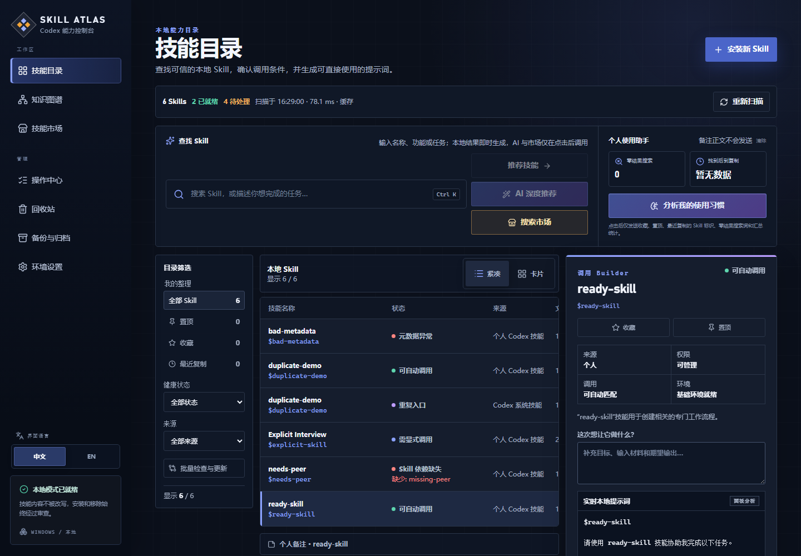

# Skill Atlas

[English](README.md)

**知道该用哪个 Codex Skill、为什么适合，以及怎样正确调用。**

[](https://github.com/NaCr05/skill-atlas/actions/workflows/ci.yml)
[](LICENSE)


Skill Atlas 是一个面向 Windows、在本机运行的 Codex Skills 管理面板。它能扫描、理解、安全安装并管理电脑上的 Skill，将不断增长的文件夹集合整理成可搜索、可正确调用的个人能力工作台，并提供就绪状态检查、关联推荐、写入前审查的生命周期控制和可选的按需 AI 辅助。



## 为什么需要 Skill Atlas？

当 Skill 越装越多时，人很难记住每个 Skill 的功能、触发规则、依赖和来源。Skill Atlas 把这些信息集中展示，并帮助你从“这项任务该用什么？”快速走到一段可以复制到 Codex 的调用 Prompt，同时不会修改已经安装的 Skill 文件。

| 你的需求 | Skill Atlas 提供的能力 |
| --- | --- |
| 找到合适的 Skill | 按名称、功能、标签搜索，或直接用自然语言描述任务；近期任务和市场结果在页面切换后仍可恢复。 |
| 判断是否真的可用 | 分别展示结构有效性、调用方式和运行环境是否就绪。 |
| 正确调用 Skill | 按当前界面语言生成可编辑的调用 Prompt。 |
| 建立个人工作台 | 收藏、置顶、添加个人备注，并查看最近复制记录。 |
| 理清来源和关系 | 查看源目录、配套文件、依赖及关联 Skill。 |
| 获得一致的中文体验 | Skill 名称保持原样，其他说明优先使用中文目录或本地确定性摘要；完整原始 `SKILL.md` 始终保留供核对。 |
| 安全检查上游变化 | 把个人 Skill 与精确 GitHub 来源逐文件比较，但不替换任何内容。 |
| 发现新的 Skill | 按任务搜索 SkillsMP 和 skills.sh，过滤已安装项，再在安装前审查 GitHub 上完整的 Skill 文件树。 |
| 集中处理清单问题 | 逐项审查重复入口和缺失依赖；显式安装依赖后自动复查并显示“已解决”或剩余依赖。 |
| 批量检查并安全更新 | 一次检查全部已记录来源的个人 Skill，勾选有更新项后逐项查看最新差异并按顺序确认更新。 |
| 管理重复入口归档 | 查看全部兼容入口归档，恢复到原位置，或在重新审查并输入完整名称后彻底清理。 |
| 查看实时操作进度 | 无需手动刷新即可查看进行中、成功、失败和已中断记录，以及对应的恢复入口。 |
| 审计每个写入阶段 | 在详情抽屉中查看预检、下载、备份、替换、验证、回滚和完成状态。 |
| 管理来源策略 | 维护可信作者/仓库和许可证名单，并按来源锁定、可信度和归档状态筛选。 |
| 管理私有存储 | 按路径和空间查看更新备份、停用 Skill 与重复归档，再恢复或审查后安全清理。 |
| 管理完整生命周期 | 停用并重新启用个人 Skill、移入可恢复回收站、原位恢复，或在重新审查并输入完整名称后永久删除单条记录。 |
| 迁移到其他电脑 | 导出并审查导入收藏、备注、历史、操作记录、来源注册表和非敏感设置；绝不导出 API Key。 |

## 目录优先工作流

首页现在就是技能目录，而不是统计面板。顶部只有一个“查找 Skill”入口：输入精确名称可以直接定位，输入任务描述会立即生成本地推荐；AI 深度推荐和市场搜索始终需要分别点击才会调用外部服务。

桌面端使用“筛选栏 → 结果清单 → 调用 Builder”三栏布局。选中一个 Skill 后，右侧会同时显示来源、权限、调用方式、环境状态、阻断原因和实时 Prompt；只有健康状态为“已就绪”的 Skill 才能复制。中等屏幕把 Builder 放入右侧抽屉，手机端则使用底部面板，并保留键盘焦点、Esc 关闭和关闭后焦点恢复。收藏、置顶和最近复制属于目录整理；个人备注位于清单下方；更新、停用和删除仍在完整详情或管理页面中完成。

健康筛选采用三种面向行动的状态：**已就绪**表示可以生成并复制 Prompt；**需要审查**表示存在重复入口或元数据问题；**需要配置**表示缺少结构化依赖或外部环境条件。知识图谱仍可从左侧导航进入，但不再占用默认首页。

## 快速启动

### Windows 安装包（无需命令行）

仓库现在已经包含 Windows 安装包构建流程。当某个 [GitHub Release](https://github.com/NaCr05/skill-atlas/releases/latest) 附带 `Skill-Atlas-Setup-*.exe` 时，可以直接下载安装，再从开始菜单或可选的桌面快捷方式打开 **Skill Atlas**。安装包自带 Node.js 运行环境；如果当前 Release 尚未提供安装包，请使用下面的源码启动器。构建和发布方式见 [Windows 分发说明](docs/windows-distribution.md)。

### 从源码启动

环境要求：Windows 10/11、Node.js 20 或更高版本（安装 Node.js 时会包含 npm）。

先克隆项目并进入目录：

```text
git clone https://github.com/NaCr05/skill-atlas.git
cd skill-atlas
```

命令提示符（CMD）运行：

```bat
start-skill-atlas.cmd
```

PowerShell 运行：

```powershell
.\start-skill-atlas.ps1
```

启动器会自动检查项目目录、Node.js、npm、项目依赖和本地端口。如果首次启动缺少依赖，请复制它显示的修复命令（`npm ci` 或 `npm.cmd ci`）执行一次，再重新启动。服务就绪后会自动选择可用端口并打开浏览器。

然后：

1. 点击**重新扫描**，读取当前电脑上的 Skill 清单。
2. 描述你要完成的任务，或直接搜索某个 Skill。
3. 打开结果，确认调用规则，然后点击**复制调用 Prompt**。
4. 把 Prompt 粘贴到 Codex，再补充你的具体任务信息。

如何辨认终端、修复 Node 缺失、处理 PowerShell 执行策略、手动启动、环境体检和生产模式，请查看[完整快速启动指南](docs/quick-start.md#中文快速启动)。

## 会扫描哪些目录？

Skill Atlas 以本地文件系统为事实来源，可以识别：

- `%CODEX_HOME%\skills` 或 `%USERPROFILE%\.codex\skills` 中的个人 Skill；
- `.system` 目录中的 Codex 系统 Skill；
- 插件缓存里当前实际生效版本所提供的 Skill；
- 作为只读兼容来源的 `.agents` 和 skill-manager 共享目录。

过期的插件缓存版本不会显示；兼容目录和共享目录保持只读。中文目录说明、本地确定性摘要和 AI 输出都不会写回已安装的 `SKILL.md`。新安装且尚未进入中文目录的英文 Skill 会得到明确标注的本地中文摘要；可疑编码会被报告为元数据问题，不会当成可信说明展示。

## 可选服务

本地清单、任务推荐和默认 Prompt 功能都不需要 API Key。AI 增强可以直接在**环境设置 → AI 连接配置台**中完成：选择提供商、填写模型和 API Key 后保存即可立即生效，刷新和重启后仍然保留。密钥使用 Windows 当前用户 DPAPI 加密，保存后不会再次回传到页面。

市场搜索和 AI 筛选是两个独立动作：点击**搜索市场候选**只查询市场，不调用大模型；只有继续点击**AI 筛选这些候选**时，才会把这批真实且尚未安装的候选交给已配置的模型排序。候选不能直接调用或加入组合；点击**审查并安装**会直接打开确定性审查单，仍须由用户另行确认后才能写入文件。

### 按需 AI 助手

本地清单、搜索、扫描、本地任务推荐和默认 Prompt 始终不需要 API Key。配置 OpenAI 或 DeepSeek 后，只有用户主动点击对应入口时才会发起一次请求：

- **AI 深度推荐**：根据任务描述解释应该使用哪些已安装 Skill；
- **AI 筛选这些候选**：只对刚刚搜索到的未安装市场候选排序；
- **智能组合 Skill**：为 2–8 个已选择 Skill 规划顺序与交接，并生成组合 Prompt；
- **让 AI 解读审查单**：把确定性安装检查转成易懂说明，但不能解除阻断风险；
- **让 AI 总结差异**：只解释更新预览，真正更新仍需单独确认；
- **分析我的使用习惯**：根据收藏、置顶、最近复制和汇总统计提出建议，不发送个人备注正文。

页面加载、输入文字、本地搜索和打开审查窗口都不会产生模型费用。失败时保留本地结果，不自动重试，也不会静默切换提供商。完整边界见[按需 AI 助手说明](docs/ai-assistance.md)。

环境变量仍作为高级配置和故障恢复入口；只有需要这种方式时，才需要把 `.env.example` 复制为 `.env.local` 并填写对应配置。

| 环境变量 | 用途 | 是否必需 |
| --- | --- | --- |
| `SKILLSMP_API_KEY` | 提高 SkillsMP 搜索额度 | 否 |
| `VERCEL_OIDC_TOKEN` | 访问 skills.sh 官方 API | 否 |
| `GITHUB_TOKEN` | 提高 GitHub 公共仓库 API 限额 | 否 |
| `AI_PROVIDER` | 选择 `auto`、`openai` 或 `deepseek`；默认 `auto` | 否 |
| `OPENAI_API_KEY` 和 `OPENAI_MODEL` | 使用 OpenAI 增强 Prompt | 否 |
| `DEEPSEEK_API_KEY` 和 `DEEPSEEK_MODEL` | 使用 DeepSeek 增强 Prompt | 否 |

页面保存的配置优先于环境变量；点击“恢复环境变量”可以删除页面配置并恢复原有环境变量。`auto` 会优先选择配置完整的 OpenAI，否则选择配置完整的 DeepSeek。所选提供商未配置或请求失败时，应用会保留本地确定性 Prompt；不会在请求时静默切换提供商。请勿提交 `.env.local`，也不要在个人备注中保存密钥。

## 安全与隐私

- 应用默认只监听 `127.0.0.1`，不包含用户账户和云同步。
- 安装 GitHub Skill 前会先检查完整文件树、脚本、元数据、大小和阻断风险。
- 安装审查还会显示仓库作者、最近提交、许可证、活跃度、版本摘要，并锁定本次确认所依据的仓库、ref、修订和完整指纹。
- 安装需要二次确认，只会写入已解析的 Codex Skills 目录；遇到同名目录会拒绝覆盖，也不会执行下载到的脚本。
- 个人 Skill 可以对比精确 GitHub 来源，并通过私有暂存、旧版备份、原子替换和自动回滚应用经审查的更新；来源记录保存在 Skill 目录之外。
- 个人可管理 Skill 可以在确定性审查和人工确认后移入 Skill Atlas 私有回收站；完整目录、指纹和来源记录都会保留，恢复时绝不覆盖已有目录。
- 个人可管理 Skill 可以移入 Codex 不会扫描的私有停用区，并在确认原位置未被占用后原位重新启用。
- 独立回收站页面会展示原安装位置和当前存放位置，支持一键恢复；只有重新通过确定性检查并输入完整 Skill 名称后，才能永久删除单条记录。
- 系统、插件、兼容目录和共享 Skill 始终只读；目前不提供自动、批量或定时清空回收站。
- 收藏、备注、最近复制、任务/搜索历史快照和轻量使用指标只保存在浏览器本地。
- 从历史恢复任务或市场结果不会自动再次调用 AI，也不会自动重复市场请求。
- 市场候选会明确标记“未安装”，不能调用或加入组合；它与技能市场结果共用“先审查、再确认安装”的安全流程。
- 验证安装成功后，可以直接查看新 Skill，或复制一段本地生成的调用 Prompt。
- 批量选择问题只会生成审查队列，不会自动修改文件。兼容目录中的重复入口必须逐项确认，完整目录会迁入私有归档；归档可恢复原位，彻底清理仍需新的单次审查和完整名称确认。
- 缺失依赖仍需用户进入市场、审查并确认安装；安装成功后会强制重新扫描，并明确显示“问题已解决”或仍缺少哪些依赖。
- 批量上游检查完全只读，最多同时检查三个来源；独立更新队列会逐项刷新并展示差异，每项都必须再次确认后才会按顺序执行原子更新。
- 操作中心通过实时事件显示本地进度；上次进程遗留的“进行中”记录会被标记为“已中断”，并保留对应恢复入口。

修改文件系统或安装逻辑前，请先阅读[安全模型](docs/security-model.md)。发现安全漏洞时，请按照 [SECURITY.md](SECURITY.md) 中的方式私下报告。

## 参与开发

```powershell
npm run typecheck
npm run lint
npm run test
npm run build
npm run test:e2e
```

相关文档：

- [快速启动](docs/quick-start.md#中文快速启动)
- [架构说明](docs/architecture.md)
- [Skill 生命周期](docs/skill-lifecycle.md)
- [开发流程](docs/development.md)
- [安全模型](docs/security-model.md)
- [测试策略](docs/testing.md)
- [贡献指南](CONTRIBUTING.md)

## 当前范围

当前版本聚焦 Codex 和 Windows。它可以批量检查已追踪的上游来源、运行逐项审查和确认的顺序更新队列、为重复入口与缺失依赖生成审查队列、归档/恢复/单独彻底清理兼容目录重复入口、在用户明确安装依赖后自动复查、停用/重新启用个人 Skill、可恢复地移除/恢复 Skill、永久删除单条已审查记录，并对少数能够用路径和指纹确定安全结果的生命周期异常执行修复。它不会静默更新 Skill、批量删除、自动安装依赖、执行 Skill 脚本、自动运行 Codex、同步云端数据或提供用户账户。Claude 兼容来源和 macOS 支持属于未来可能方向，并不是当前承诺。

## 贡献与许可证

欢迎提交 Issue 和 Pull Request。提出改动前请阅读 [CONTRIBUTING.md](CONTRIBUTING.md)。

项目使用 [MIT License](LICENSE) 开源。Copyright © 2026 NaCr05。
