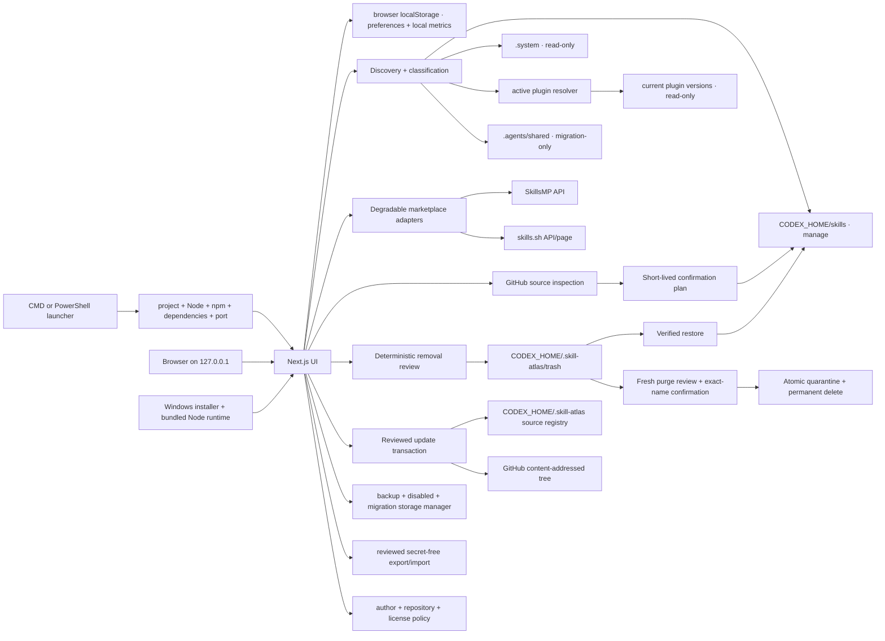

# Architecture

## Product boundary

Skill Atlas is one local Next.js process and one browser session. It has no database, account system, background agent, or cloud state. Installed files are authoritative; inferred fields exist only in the scan response.

## Modules

- `src/core/skills`: resolves Windows paths; locates, parses, classifies, relates, and prompts from Skills.
- `src/core/skills/recommend.ts`: ranks installed Skills from task descriptions using deterministic bilingual intent signals and local Skill metadata.
- `src/core/local-workspace.ts`: validates and bounds browser-local favorites, pins, notes, recent copies, and feedback metrics.
- `src/core/marketplaces`: normalizes external provider responses, deterministically filters installed/duplicate/unrelated candidates, namespaces candidate IDs by provider, and returns explicit unavailable states.
- `src/core/installer`: parses GitHub sources, reviews repository trees, maintains short-lived in-memory plans, stages downloads, verifies `SKILL.md`, and atomically renames the staged directory.
- `src/core/review-plans`: owns the bounded, expiring, one-use capability store shared by install, update, removal, and purge reviews.
- `src/core/errors`: defines stable application error codes and turns them into request-language API messages without exposing raw internal exceptions.
- `src/core/async`: provides framework-independent latest-request-wins coordination for task- and query-dependent work.
- `src/core/github`: resolves GitHub Skill directories, content-addressed trees, blobs, metadata, and remote fingerprints for both installation and lifecycle inspection.
- `src/core/lifecycle`: fingerprints complete local Skill directories, stores source associations outside installed Skills, compares local and upstream manifests, and owns removal, restore, and private-trash purge transactions behind one lifecycle interface.
- `src/core/issues`: converts inventory evidence into stable duplicate/dependency issues and owns the separately reviewed compatibility-entry migration boundary.
- `src/core/operations`: records bounded running/succeeded/failed lifecycle evidence without becoming the authority for the underlying mutation.
- `src/core/storage`: accounts for update backups, disabled directories, and migration archives; destructive cleanup uses a one-use review, fingerprint revalidation, and purge quarantine.
- `src/core/source-policy`: stores normalized trust and license rules and evaluates them as deterministic installation risks.
- `src/core/data-portability.ts`: creates secret-free server snapshots and reviewed merge imports with a private pre-import backup.
- `src/core/releases`: performs an explicitly requested GitHub release check and semantic version comparison.
- `src/core/github`: inspects GitHub trees and adds best-effort repository trust evidence while retaining the content fingerprint as the installation authority.
- `src/core/security`: rejects mutating requests with non-local Host or Origin values.
- `src/core/environment`: inspects the running source tree, Node/npm, dependencies, Codex home, and personal Skills directory without mutating them.
- `src/core/ai`: resolves OpenAI/DeepSeek routing, persists page-managed settings outside the repository, and protects saved credentials with Windows current-user DPAPI.
- `src/app/api`: thin validated route handlers. Business rules stay in `src/core` for direct tests.
- `src/components`: interface surfaces and confirmation checkpoints.
- `scripts/startup/launcher.mjs`: owns Windows preflight, bounded free-port selection, server startup, readiness polling, and browser opening for both root launcher files.
- `scripts/windows/package-windows.mjs` and `packaging/windows`: stage the Next.js standalone output with the current Node runtime and compile the per-user Inno Setup installer.

## Startup model

The `.cmd` and `.ps1` files only locate their own project directory, detect the special case where Node.js is entirely absent, and delegate to one launcher module. The launcher never installs software implicitly. A missing prerequisite blocks startup and prints exact CMD and PowerShell repair commands. An occupied preferred port is not a failure: the launcher searches the next ten ports, starts on the first free one, waits for an HTTP response, and then opens the browser.

The Settings page reports the state of the already-running process. Its local-service check therefore reports the active bind address rather than treating that port as unexpectedly occupied. This separation avoids contradictory health results.

## Inventory model

Each `SkillRecord` carries source and permission, parsed author facts, invocation status, structural validity, environment readiness, issues, full resource manifest, a deterministic directory fingerprint, source-tracking state, declared dependencies, non-blocking instruction references, inferred relationships/use cases, invocation policy, and provenance labels. Status analysis never changes the source document.

List, graph, recommendation, and rescan boundaries serialize `SkillSummary`, which deliberately omits the full `SKILL.md` body. A single-Skill detail read returns `SkillRecord` and loads the instruction body on demand. This keeps initial client payloads proportional to metadata rather than to the combined size of every installed instruction document.

Invocation policy, structure, and environment are separate dimensions:

- Invocation policy answers whether Codex may select the Skill automatically, must be explicitly prompted, or has declared conditions.
- Structure answers whether `SKILL.md` and its metadata can be parsed.
- Environment answers whether structured, declared Skill dependencies are present and whether declared external tools still need session-level verification.

Dependency classification deliberately uses separate confidence levels:

- `dependencies.skills` in `SKILL.md` frontmatter or `agents/openai.yaml` is a hard dependency. A missing installed Skill can block environment readiness.
- `related_skills` and `$skill-name` references in prose are non-blocking candidates. Candidates are promoted into visible relationships only when their name matches an installed Skill, so ordinary inline variables do not appear as capabilities.
- Fenced code blocks are excluded from reference extraction, so shell variables such as `$dest`, `$source`, and `$package` cannot be mistaken for Skill names.
- `dependencies.tools` remains an external-tool declaration and produces an unverified environment state rather than a missing Skill state.

Plugin discovery does not recursively expose every cached release. It resolves active plugin IDs from `config.toml`, remote-install markers, and `latest` pointers, then selects one valid version root per plugin. Every plugin-backed `SkillRecord` retains its channel, plugin name, and selected version for provenance.

Source precedence for remaining same-name entries is personal, system, plugin, then compatibility. The preferred entry keeps its base status plus a duplicate marker; lower-priority entries receive the primary `duplicate` status. Stale cached plugin releases are removed before this duplicate pass.

Related Skills are ranked from declared Skill dependencies, non-blocking instruction references, shared tags, shared declared tools, shared name themes, and name-to-purpose overlap. Declared dependencies outrank instruction references; both outrank inferred semantic signals. Frequency thresholds and a stopword set exclude same-name entries and low-signal generic matches.

## Prompt model

1. Always begin with the exact `$skill-name` trigger.
2. In English mode, use `agents/openai.yaml` `interface.default_prompt` when available and no task is supplied.
3. In Chinese mode, always construct a Chinese deterministic template instead of exposing an English author default.
4. Otherwise construct the language-matched deterministic template from the supplied task.
5. When explicitly selected, resolve `AI_PROVIDER` as `openai`, `deepseek`, or `auto`. `auto` prefers a complete OpenAI configuration and then a complete DeepSeek configuration.
6. Send only the Skill name, description, and base Prompt to the selected adapter: OpenAI Responses API or DeepSeek Chat Completions. Provider credentials remain server-side.
7. Accept AI output only when it preserves the exact trigger and requested language.
8. Missing configuration, network failures, non-success responses, unreadable payloads, or invalid output return the base Prompt with a notice. Request-time failures never trigger a silent cross-provider failover.

Page-managed AI settings are stored in `CODEX_HOME/.skill-atlas/ai-settings.json`. Only encrypted DPAPI ciphertext, model names, routing preference, and update time are persisted. These settings override corresponding environment variables. Removing the page settings file through the Settings action restores environment-variable resolution. API routes read this runtime configuration for each enhancement request, so saving does not require a process restart.

## On-demand AI advisory model

`POST /api/ai/assist` is the single provider boundary for task recommendation, grounded market-candidate ranking, multi-Skill composition, installation explanation, update-difference summaries, and personal usage assistance. Every call originates from a separate user-click handler; no effect, page load, keystroke, local search, marketplace search, rescan, inspection, or update comparison calls this route.

Each action has a strict Zod input and output schema. Server preparation bounds catalogs and file lists, treats every user, Skill, and marketplace field as untrusted data, and supplies exact allowlists. Provider output that invents Skills or market candidate IDs, omits selected composition steps, uses the wrong language, or contradicts a deterministic installation blocker is rejected. Composition order is AI-advised, but the final copyable Prompt is constructed locally from validated steps. Requests have one 30-second attempt and never fail over to another provider.

Task AI, task-market discovery, marketplace search, market ranking, and install inspection use named latest-request-wins lanes. Editing the dependent task or query aborts and invalidates the old lane, so a slower old completion cannot replace results for newer user intent.

Installation and update advice consume only already-generated deterministic review data. They do not receive mutation capability, plan identifiers, credentials, file contents, or provider authority. Personal assistance receives favorites, pins, recent Skill identifiers, zero-result queries, and aggregate timing; note bodies are excluded. See [On-demand AI assistance](ai-assistance.md).

Marketplace discovery is a staged flow. The first explicit button calls the SkillsMP search and skills.sh leaderboard adapters without using AI. The browser filters installed names and duplicate flags; skills.sh leaderboard entries must also match deterministic task terms. A second explicit button may send at most 20 grounded candidates to AI. Ranked candidates remain uninstalled. Both marketplace cards and task candidates explicitly call the same inspection endpoint and open the same review dialog; inspection and installation confirmation remain separate actions.

After confirmation, the inventory cache is invalidated. The success panel can build a deterministic invocation Prompt from the installed name and reviewed description without calling AI, or navigate to `/skills?skill=<name>` so the newly installed Skill is filtered and selected after the fresh server-side scan.

## Local feedback loop

Local task recommendations run in the browser and never send task descriptions externally. The separately labeled **AI deep match** action sends the task only after an explicit click. The browser-local workspace stores favorites, pins, notes, the 20 most recently copied Skills, up to 100 zero-result search events, and up to 100 copy-journey durations. Search events are recorded only after an explicit recommendation submission or Enter on a zero-result inventory search; ordinary keystrokes are not logged. The insights panel can clear all of this data.

“Found-to-copy” starts when the user selects a Skill or recommendation. If the Prompt dialog is opened without a prior selection event, dialog-open time is the fallback. Durations are capped at 30 minutes so abandoned tabs do not distort the median.

## Runtime state

There is no persistent application database. The server keeps two bounded in-memory caches:

- Inventory responses remain valid for 30 seconds. Normal page/API reads reuse them, the **Rescan** action bypasses them, and a successful installation invalidates them.
- Installation, removal, permanent-deletion, and update-preview plans all use one review-plan module. They expire after ten minutes, are consumed on the first confirmation attempt, and are capped at 200 entries per namespace.

## Frontend style layers

`src/app/globals.css` contains only ordered imports. Semantic design values live in `src/styles/tokens.css`; resets and accessibility primitives live in `base.css`; reusable shell, inventory, dialog, and history patterns live under `components/`; route-owned layouts live under `pages/`; on-demand AI presentation lives under `features/`. Dark-theme and bilingual overrides load last so their cascade order is explicit and regression-testable.

## Update-awareness model

Every bounded Skill directory receives a `sha256-manifest-v1` fingerprint built from normalized relative paths, sizes, and Git blob hashes. The GitHub tree already exposes the corresponding content-addressed blob hashes, so update inspection can compare every file while downloading only `SKILL.md` for metadata validation.

New GitHub installations automatically record their exact source URL, repository, ref, tree revision, upstream fingerprint, and installed fingerprint. Existing personal Skills remain untracked until the user supplies an exact GitHub directory and confirms the comparison. That association is stored in `CODEX_HOME/.skill-atlas/source-registry.json`; installed `SKILL.md` files remain untouched.

The batch checker selects only personal, manageable, source-tracked Skills, runs at most three read-only inspections concurrently, stores a bounded overview in `CODEX_HOME/.skill-atlas/update-status.json`, and preserves per-Skill failures. The cached IDs drive the **Updates available** inventory filter. The batch-update queue is a browser coordinator, not a bulk capability: it requests a fresh one-Skill preview for the current item, displays that exact diff, consumes one confirmation plan if approved, updates the cache, and only then advances to the next item.

## Issue and operation model

Inventory issue planning is pure and read-only. A multi-selection creates a browser review queue, never a filesystem transaction. Missing dependencies hand off to a prefilled marketplace search carrying the issue and consumer identifiers. A successful explicit installation invalidates inventory caches, forces a fresh scan, and reports whether the issue disappeared or which dependencies remain. A duplicate is mutable only when the candidate is an exact direct child of a configured compatibility root, another same-name entry remains active, and a fresh bounded fingerprint is available. Confirmation moves the complete directory to `CODEX_HOME/.skill-atlas/migrations/<id>/skill`, writes a transaction journal, verifies the archive, and restores the original on failure. The archive reader exposes valid and damaged records; valid records support collision-safe in-place restore or a separate one-use, exact-name purge review through private quarantine.

The Operations Center reads four independent evidence sources: current inventory issues, migration archives, the batch update cache, and `CODEX_HOME/.skill-atlas/operations.json`. Every write route records a running entry before work and a success or stable failure code afterward. A localhost-only SSE route publishes changed operation snapshots, with bounded polling only as a disconnected fallback. Each process owns a runtime identifier; a running record owned by a previous runtime is persisted as `interrupted` and retains its recovery link. The operation record provides navigation and auditability, but lifecycle journals and fingerprints remain the recovery authority.

Update inspection reports added, modified, removed, and unchanged files, detects local divergence, and highlights scripts and metadata changes. Confirmation consumes the one-use preview, downloads only its reviewed content-addressed blobs into private staging, verifies the complete target fingerprint, renames the current Skill into a private backup, atomically installs the staged directory, verifies again, and updates provenance. Any failure after the backup move triggers verified rollback; the old version remains retained after success.

Removal, restoration, disable, and enable are write-enabled only for direct personal manageable Skill directories. Disable moves a verified directory under `CODEX_HOME/.skill-atlas/disabled` so Codex no longer discovers it; enable refuses an occupied original target and restores the same fingerprint in place. The same transaction journal, one-use review, real-path constraints, and rollback boundary are shared across lifecycle operations. See [Skill lifecycle](skill-lifecycle.md).

Restarting the process invalidates both stores, which is safe and intentional.

Browser-local preferences, metrics, bounded task history, and bounded marketplace-result snapshots survive a server restart and page refresh because they are stored in versioned `localStorage`. Replaying a history item reads only that snapshot: it does not repeat an AI or marketplace request. These records never modify installed Skill files and are not synchronized to a server.
