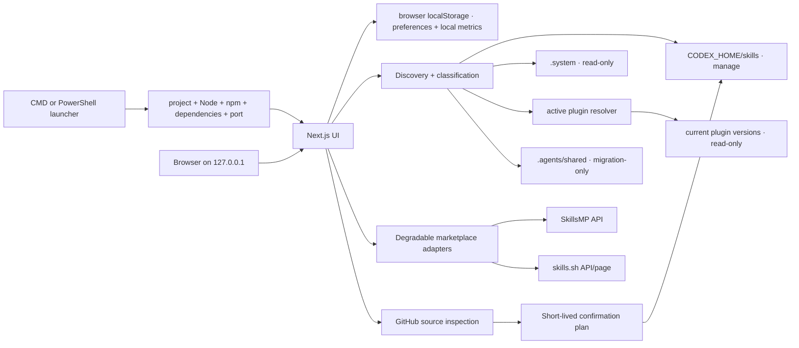

# Architecture

## Product boundary

Skill Atlas is one local Next.js process and one browser session. It has no database, account system, background agent, or cloud state. Installed files are authoritative; inferred fields exist only in the scan response.

## Modules

- `src/core/skills`: resolves Windows paths; locates, parses, classifies, relates, and prompts from Skills.
- `src/core/skills/recommend.ts`: ranks installed Skills from task descriptions using deterministic bilingual intent signals and local Skill metadata.
- `src/core/local-workspace.ts`: validates and bounds browser-local favorites, pins, notes, recent copies, and feedback metrics.
- `src/core/marketplaces`: normalizes external provider responses into one UI contract and returns explicit unavailable states.
- `src/core/installer`: parses GitHub sources, reviews repository trees, maintains short-lived in-memory plans, stages downloads, verifies `SKILL.md`, and atomically renames the staged directory.
- `src/core/security`: rejects mutating requests with non-local Host or Origin values.
- `src/core/environment`: inspects the running source tree, Node/npm, dependencies, Codex home, and personal Skills directory without mutating them.
- `src/app/api`: thin validated route handlers. Business rules stay in `src/core` for direct tests.
- `src/components`: interface surfaces and confirmation checkpoints.
- `scripts/startup/launcher.mjs`: owns Windows preflight, bounded free-port selection, server startup, readiness polling, and browser opening for both root launcher files.

## Startup model

The `.cmd` and `.ps1` files only locate their own project directory, detect the special case where Node.js is entirely absent, and delegate to one launcher module. The launcher never installs software implicitly. A missing prerequisite blocks startup and prints exact CMD and PowerShell repair commands. An occupied preferred port is not a failure: the launcher searches the next ten ports, starts on the first free one, waits for an HTTP response, and then opens the browser.

The Settings page reports the state of the already-running process. Its local-service check therefore reports the active bind address rather than treating that port as unexpectedly occupied. This separation avoids contradictory health results.

## Inventory model

Each `SkillRecord` carries source and permission, parsed author facts, invocation status, structural validity, environment readiness, issues, full resource manifest, explicit dependencies, inferred relationships/use cases, invocation policy, and provenance labels. Status analysis never changes the source document.

Invocation policy, structure, and environment are separate dimensions:

- Invocation policy answers whether Codex may select the Skill automatically, must be explicitly prompted, or has declared conditions.
- Structure answers whether `SKILL.md` and its metadata can be parsed.
- Environment answers whether local Skill dependencies are present and whether declared external tools still need session-level verification.

Plugin discovery does not recursively expose every cached release. It resolves active plugin IDs from `config.toml`, remote-install markers, and `latest` pointers, then selects one valid version root per plugin. Every plugin-backed `SkillRecord` retains its channel, plugin name, and selected version for provenance.

Source precedence for remaining same-name entries is personal, system, plugin, then compatibility. The preferred entry keeps its base status plus a duplicate marker; lower-priority entries receive the primary `duplicate` status. Stale cached plugin releases are removed before this duplicate pass.

Related Skills are ranked from explicit Skill dependencies, shared tags, shared declared tools, shared name themes, and name-to-purpose overlap. Frequency thresholds and a stopword set exclude same-name entries and low-signal generic matches.

## Prompt model

1. Always begin with the exact `$skill-name` trigger.
2. In English mode, use `agents/openai.yaml` `interface.default_prompt` when available and no task is supplied.
3. In Chinese mode, always construct a Chinese deterministic template instead of exposing an English author default.
4. Otherwise construct the language-matched deterministic template from the supplied task.
5. When explicitly selected, send only the Skill name, description, and base Prompt to the optional OpenAI Responses API adapter. Application rules use `instructions`; dynamic data uses `input`.
6. Accept AI output only when it preserves the exact trigger and requested language; otherwise return the base Prompt with a notice.

## Local feedback loop

Task recommendations run in the browser and never send task descriptions to an external provider. The browser-local workspace stores favorites, pins, notes, the 20 most recently copied Skills, up to 100 zero-result search events, and up to 100 copy-journey durations. Search events are recorded only after an explicit recommendation submission or Enter on a zero-result inventory search; ordinary keystrokes are not logged. The insights panel can clear all of this data.

“Found-to-copy” starts when the user selects a Skill or recommendation. If the Prompt dialog is opened without a prior selection event, dialog-open time is the fallback. Durations are capped at 30 minutes so abandoned tabs do not distort the median.

## Runtime state

There is no persistent application database. The server keeps two bounded in-memory caches:

- Inventory responses remain valid for 30 seconds. Normal page/API reads reuse them, the **Rescan** action bypasses them, and a successful installation invalidates them.
- Installation plans expire after ten minutes and are consumed on the first confirmation attempt.

Restarting the process invalidates both stores, which is safe and intentional.

Browser-local preferences and metrics survive a server restart and page refresh because they are stored in versioned `localStorage`. They never modify installed Skill files and are not synchronized to a server.
