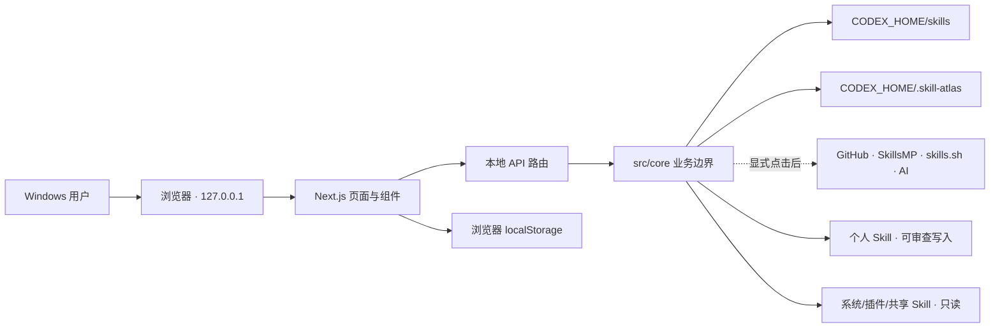

# Skill Atlas 新人上手指南

> 适用基线：`main` / `bbae7ec`，2026-08-04
>
> 项目定位：Windows-first、本地运行的 Codex Skill 管理面板
>
> 重要提醒：当前 `main` 包含尚未进入 `v0.1.1` Release 的生命周期功能；源码能力与最近公开安装版本不是同一快照。

## 两分钟项目简介

Skill Atlas 读取本机 Codex 的 Skill 目录，将分散的 `SKILL.md` 和配套文件整理成可搜索、可解释、可调用的能力清单。用户可以按任务寻找已安装 Skill、查看关联关系、复制一段适合粘贴到 Codex 的调用 Prompt，也可以从市场发现候选 Skill，在检查来源、目录和风险后再确认安装。

对于个人可管理的 Skill，项目还提供来源追踪、安全更新、停用与启用、回收站、恢复、永久清理、备份/归档、恢复中心和操作记录。系统 Skill、插件 Skill 及兼容共享入口保持只读。基础清单和 Prompt 不依赖 API；OpenAI、DeepSeek、SkillsMP 和 skills.sh 都是可选增强。

### 当前状态

| 分类 | 内容 |
| --- | --- |
| **已实现且验证** | 本地扫描、双语 UI、确定性 Prompt、任务推荐、图谱、个人工作台、审查后安装、更新事务、停用/恢复、回收站、恢复中心、操作中心、来源策略、数据导入导出、CMD/PowerShell 启动和 Chromium 关键旅程。 |
| **已实现但未验证** | 真实市场/模型请求、真实第三方仓库安装与更新、真实个人目录上的破坏性操作、Windows `.exe` 安装与升级。 |
| **计划中或未完成** | 包含当前 `main` 功能的新版本标签和 Release；macOS、Claude、多用户/远程部署等扩展。 |

## 目标用户与核心流程

### 目标用户

- 在 Windows 上使用 Codex、已经安装较多 Skill，希望快速回忆“有什么、何时用、怎样调用”的个人用户。
- 需要审查第三方 Skill 来源和目录，不愿直接运行未知安装脚本的谨慎用户。
- 维护 Skill 集合，希望安全更新、停用、恢复、迁移或清理的高级用户。

### 核心流程一：找到并调用已安装 Skill

1. 启动 Skill Atlas，进入**本地技能**并重新扫描。
2. 搜索名称/功能，或在“按任务找 Skill”中描述目标。
3. 查看结构、调用策略、环境、依赖、来源和关联 Skill。
4. 点击**复制调用 Prompt**。
5. 切换到 Codex，把 Prompt 粘贴到任务中并补充项目路径或材料。

### 核心流程二：发现并安装 Skill

1. 在**技能市场**搜索，或从任务推荐进入未安装候选。
2. 打开来源并进入安装审查。
3. 检查精确 GitHub 目录、文件树、提交/许可证信息、脚本和阻断项。
4. 只有在确认后才执行安装；安装成功会使清单缓存失效并重新扫描。
5. 复制新 Skill 的确定性 Prompt，或在清单中定位它。

### 核心流程三：管理生命周期

1. 对个人可管理 Skill 检查上游差异或选择停用/移入回收站。
2. 查看新鲜审查结果；确认时系统重新验证路径、指纹和目标冲突。
3. 写操作使用私有暂存/备份、事务日志和原子移动。
4. 在**操作中心**查看阶段、失败原因和恢复入口。
5. 在**回收站**或**恢复中心**恢复、清理或处理异常事务。

## 技术栈和架构图

| 层 | 技术与职责 |
| --- | --- |
| Web 框架 | Next.js 16 App Router、React 19、TypeScript；页面和本地 API 同进程运行。 |
| 数据校验 | Zod；外部响应、API 输入和 AI 输出都按契约验证。 |
| Skill 解析 | `yaml` 与文件系统扫描；摘要用于列表，完整正文按详情请求加载。 |
| 图谱与图标 | `@xyflow/react`、`lucide-react`。 |
| 自动化测试 | Vitest、Testing Library、Playwright Chromium。 |
| 生命周期存储 | `CODEX_HOME/.skill-atlas` 下的来源注册表、指纹、事务、回收站、备份、停用目录、操作记录和策略。 |
| 浏览器本地状态 | 版本化 `localStorage`，保存收藏、置顶、备注、历史和本地指标。 |
| Windows 分发 | CMD/PowerShell 源码启动器；Next.js standalone、Node runtime 与 Inno Setup 安装器配方。 |



架构细节见 [Architecture](architecture.md)，写入和信任边界见 [Security model](security-model.md)。

## 目录地图与关键入口

| 路径 | 作用 | 新人先看什么 |
| --- | --- | --- |
| [`AGENTS.md`](../AGENTS.md) | 仓库最高优先级的工程、权限和验证规则 | 修改代码前完整阅读。 |
| [`src/app`](../src/app) | 页面和薄 API 路由 | 从 `page.tsx` 和对应 `api/**/route.ts` 找入口。 |
| [`src/components`](../src/components) | 客户端交互、对话框、工作台和管理界面 | 写入动作必须保留清晰审查与确认。 |
| [`src/core/skills`](../src/core/skills) | 路径解析、发现、解析、分类、关联、推荐和 Prompt | 理解清单事实来源与摘要/正文分离。 |
| [`src/core/installer`](../src/core/installer) | GitHub 来源检查、安装计划和确认写入 | 安装检查不能写文件。 |
| [`src/core/lifecycle`](../src/core/lifecycle) | 指纹、更新、停用、回收、恢复和事务对账 | 任何生命周期修改都要考虑回滚与恢复。 |
| [`src/core/issues`](../src/core/issues) | 重复入口与依赖问题规划、兼容入口归档 | 批量规划保持只读，单项写入单独确认。 |
| [`src/core/operations`](../src/core/operations) | 运行中/成功/失败/中断记录与阶段进度 | 操作记录用于审计导航，不替代事务事实。 |
| [`src/core/ai`](../src/core/ai) | OpenAI/DeepSeek 路由、严格契约和 DPAPI 配置 | AI 只能建议，不能授权写入。 |
| [`src/core/marketplaces`](../src/core/marketplaces) | SkillsMP 和 skills.sh 的降级适配器 | UI 不直接依赖提供商私有响应格式。 |
| [`src/styles`](../src/styles) | token、基础、组件、页面、功能、主题与 i18n 样式层 | 不要重新堆回单个全局 CSS。 |
| [`tests`](../tests) | 单元、集成、E2E 和隔离夹具 | 先复用夹具，不要指向真实个人目录。 |
| [`scripts/startup`](../scripts/startup) | 统一启动预检和 standalone 准备 | 根目录两个启动器只做薄包装。 |
| [`packaging/windows`](../packaging/windows) | Windows 安装器和桌面启动入口 | 修改后需在 Windows runner 实际打包。 |

## 数据流

### 清单与详情

```text
磁盘 Skill 目录
  → 解析与分类
  → 30 秒摘要缓存
  → 清单 / 图谱 / 搜索 / 推荐
  → 用户打开单个 Skill
  → 按需读取完整 SKILL.md 和资源清单
```

扫描不会把推断出的描述、标签、关系或状态写回 `SKILL.md`。成功安装和生命周期变更会使清单缓存失效。

### 安装与更新

```text
用户提供精确来源
  → 只读检查目录、元数据、风险和指纹
  → 生成短期、限量、一次性计划
  → 用户明确确认
  → 私有暂存下载
  → 校验完整指纹
  → 原子安装/备份替换
  → 再次校验并记录来源
  → 失败时回滚与恢复入口
```

第三方 Skill 中的脚本不会在安装或更新时执行。AI 解释只读取已生成的确定性审查结果，也不能解除阻断。

## 安装、运行和测试方法

### 先决条件

- Windows 10 或 Windows 11。
- Node.js 20 或更高版本；npm 随 Node.js 提供。
- Git。
- 运行端到端测试时，需要 Playwright Chromium。

### 首次安装

CMD 和 PowerShell 都可以执行：

```text
git clone https://github.com/NaCr05/skill-atlas.git
cd skill-atlas
npm ci
```

请先确认当前提示符已经位于 `skill-atlas` 目录；否则 npm 会找不到 `package.json`。

### 推荐启动

CMD：

```bat
start-skill-atlas.cmd
```

PowerShell：

```powershell
.\start-skill-atlas.ps1
```

启动器会检查项目目录、Node.js、npm 和依赖，在 3000 至 3010 中选择可用端口，等待本地服务响应后再打开浏览器。终端必须保持开启，按 `Ctrl+C` 停止。

只检查环境而不启动：

```bat
start-skill-atlas.cmd --check
```

```powershell
.\start-skill-atlas.ps1 --check
```

### 手动开发启动

```text
npm run dev
```

默认只监听 `127.0.0.1`。生产模式本地验证：

```text
npm run build
npm run start
```

### 可选配置

本地清单、确定性 Prompt 和生命周期管理不需要外部密钥。可选配置只记录以下变量名；不要把任何值、密钥或本地配置文件提交到 Git：

| 用途 | 变量名 |
| --- | --- |
| 自定义 Codex 根目录 | `CODEX_HOME` |
| SkillsMP | `SKILLSMP_API_KEY` |
| GitHub | `GITHUB_TOKEN`、`VERCEL_OIDC_TOKEN` |
| AI 路由 | `AI_PROVIDER` |
| OpenAI | `OPENAI_API_KEY`、`OPENAI_MODEL` |
| DeepSeek | `DEEPSEEK_API_KEY`、`DEEPSEEK_MODEL` |

AI 也可以在**环境设置 → AI 连接配置台**中显式保存。Windows 上的保存密钥由当前用户 DPAPI 加密，服务端不会把密钥值返回页面；页面设置优先于环境变量。

### 测试与交付门禁

常用单项检查：

```text
npm run typecheck
npm run lint
npm run test
npm run build
npm run test:e2e
```

完整基础门禁：

```text
npm run verify
```

首次运行 Playwright 前如缺少浏览器：

```text
npx playwright install chromium
```

截至 2026-08-04，当前基线的实际结果是：

- `npm.cmd run verify` 通过；Vitest 129 项通过、1 项按条件跳过，生产构建成功。
- `npm.cmd run test:e2e` 通过；Chromium 24/24。
- CMD 和 PowerShell 启动器 `--check` 均通过。
- 当前提交的 GitHub `main` CI 通过。

真实 GitHub 安装测试默认不会运行；它有单独的显式开关，且不应在不受控目录中启用。Windows 安装器需要 Inno Setup 6；详见 [Windows distribution](windows-distribution.md)。

## 常见开发任务

| 任务 | 推荐路径 | 必须保留的约束 |
| --- | --- | --- |
| 修改扫描或状态判断 | `src/core/skills` → 单元/集成发现测试 → 清单 E2E | 不改写源 Skill；结构、调用和环境状态保持分离。 |
| 新增 API 行为 | 先在 `src/core` 写业务边界，再加薄 `src/app/api` 路由 | 输入校验、本地请求保护、稳定本地化错误码。 |
| 新增写操作 | 复用审查计划、指纹、事务、操作记录和恢复机制 | 检查阶段只读；一次确认只消费一次计划；失败可恢复。 |
| 修改安装或更新 | `src/core/installer`、`src/core/github`、`src/core/lifecycle` | 不执行下载脚本；精确路径、内容地址、暂存、验证和回滚。 |
| 新增 AI 功能 | `src/core/ai` 契约 → 独立按钮 → 模拟测试 | 页面加载、输入、扫描和本地搜索不得自动调用；AI 不能授权写入。 |
| 新增市场提供商 | 实现 `src/core/marketplaces` 的统一适配契约 | 提供商失败可降级；候选仍需安装审查。 |
| 修改对话框 | 复用 `accessible-dialog` | 初始焦点、Tab 圈定、Esc、关闭后恢复焦点和写入锁。 |
| 修改样式 | 在 `src/styles` 的正确层或组件模块中调整 | 保持 token/基础/组件/页面/主题顺序；检查中英文、桌面和移动端。 |
| 更新公开截图 | 先构建，再运行专用截图流程并人工检查全部 `artifacts` | 只使用测试夹具；不读取真实个人 Skill。 |
| 修改 Windows 分发 | `scripts/startup`、`scripts/windows`、`packaging/windows` | 在干净 Windows runner 生成并安装 `.exe`，检查升级和卸载。 |

## 易踩坑点和排错方法

### 1. 当前目录不对

症状：npm 报告找不到 `package.json` 或 lockfile。

处理：进入已经克隆的 `skill-atlas` 目录，再执行安装和启动命令；不要重复克隆。

### 2. 混用 CMD 与 PowerShell 语法

CMD 不认识 `Set-Location`，PowerShell 可能因脚本策略阻止 `.ps1` 或 npm 的 PowerShell 入口。优先使用本指南对应终端的启动器；PowerShell 中也可调用 Windows 命令入口 `npm.cmd`。

### 3. 端口已占用

源码启动器会在有限范围内自动回退。本轮实测 3000 被占用时选择了 3001。手动启动需要自己指定其他端口，并确认没有遗留 Next.js 进程。

### 4. 页面没有个人 Skill

确认个人 Skill 是目标根目录下的直接子目录，并包含 `SKILL.md`。如果使用自定义根目录，`CODEX_HOME` 必须是绝对路径。随后点击**重新扫描**。

### 5. “结构有效”不等于“环境就绪”

结构检查只说明 Skill 可解析；硬 Skill 依赖和外部工具声明属于环境维度。正文里的 `$name` 仅作为非阻断关系候选，不应直接判为缺失依赖。

### 6. 不是所有 Skill 都可写

只有个人、可管理、直接子目录的 Skill 可安装、更新、停用或删除。系统、插件、共享及兼容来源默认只读；重复兼容入口有单独的审查后归档流程。

### 7. 市场或 AI 不可用

这不会阻断本地清单和确定性 Prompt。检查环境设置、网络和服务配额；模型失败不会静默切换到另一个付费提供商。

### 8. 浏览器数据与服务端数据不是一回事

收藏、置顶、备注和历史保存在浏览器配置中；生命周期记录保存在 `CODEX_HOME/.skill-atlas`。浏览器备注未加密，不要写入密钥。导入导出设计为无密钥迁移。

### 9. 测试不能指向真实个人目录

端到端测试必须使用 `tests/fixtures` 和专用根目录。任何生命周期人工验证也应先使用临时目录，确认目标路径后再执行。

### 10. 代码合并不代表版本已发布

当前 `main` 比 `v0.1.1` 多出大批生命周期能力。判断普通用户能否获得某功能时，应同时检查版本号、标签、Release 和安装包附件，而不是只看源码。

## 新人第一天建议

1. 完整阅读 [`AGENTS.md`](../AGENTS.md)、[Architecture](architecture.md) 和 [Security model](security-model.md)。
2. 按上面的首次安装和推荐启动步骤打开网站。
3. 运行 `npm run verify` 与 `npm run test:e2e`，确认本机基线。
4. 从 `src/core/skills`、`src/app/skills/page.tsx` 和 `tests/e2e/dashboard.spec.ts` 跟一遍“扫描 → 详情 → 复制 Prompt”链路。
5. 再从安装或回收流程选择一条，观察“检查 → 计划 → 确认 → 事务 → 操作记录 → 恢复”的共同模式。
6. 只在理解写入权限、指纹和回滚边界后修改生命周期代码。

## 仍需向维护者确认

- 下一个版本号、发布时间和是否把当前 `main` 的全部 Unreleased 功能纳入同一 Release。
- Windows 安装器首次公开发布前的人工验收清单与签名策略。
- 真实外部服务冒烟测试使用哪些测试账户、仓库和费用上限。
- macOS、Claude、远程/多用户使用是否进入近期路线图，还是保持明确的非目标。
- `docs/skill-lifecycle.md` 中旧能力表述的修订时间。
