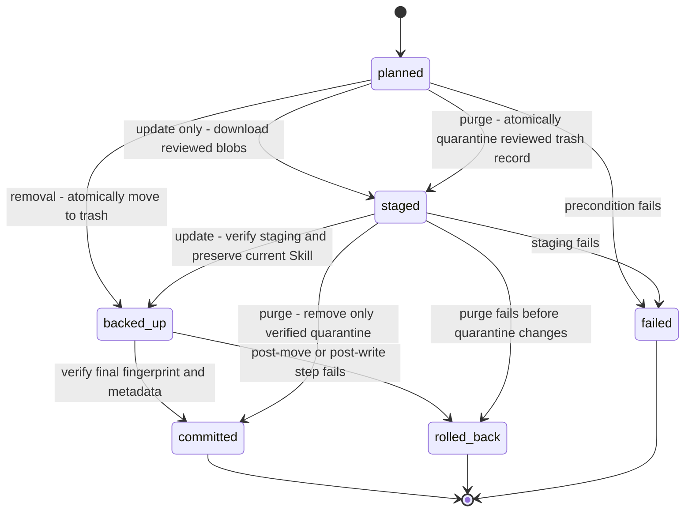

# Skill lifecycle management

## Current capabilities

Personal Skill updates, disable/enable, removal, and restoration are write-enabled through recoverable transactions. A Skill can be linked to an exact GitHub directory, compared file by file, and updated only after deterministic review and explicit confirmation.

Source association changes only `CODEX_HOME/.skill-atlas/source-registry.json`. It never rewrites the installed `SKILL.md` or adds metadata to the Skill directory.

| Capability | Current behavior |
| --- | --- |
| Check upstream | Available for personal manageable Skills with an exact GitHub source |
| File differences | Complete bounded directory comparison by content identity |
| Script and metadata risk | Disclosed before any future write operation |
| Save provenance | Explicit confirmation, external local registry only |
| Replace files | Not available |
| Disable or enable | Not available |
| Move a personal Skill to trash | Available after deterministic review and human confirmation |
| Restore from Skill Atlas trash | Available when the original target is unoccupied |
| Permanent deletion | Available per trash record after fresh review and exact-name confirmation |
| Apply reviewed update | Available with private staging, retained backup, atomic replacement, and rollback |
| Disable / re-enable | Available for direct personal manageable Skills; restores only to an unoccupied original path |
| Automatic rollback | Available for removal and restore; purge rolls back only while the quarantined copy remains complete |
| Reconciliation and recovery | Reports all anomalies and offers explicit actions only for currently provable safe repair cases |

## Fingerprint and baseline

`sha256-manifest-v1` sorts normalized relative file paths and combines each path, byte size, and Git blob SHA into one directory digest. GitHub exposes blob SHAs through its tree API; local files calculate the same Git blob identity from their bytes.

When a source is first confirmed, Skill Atlas records both the upstream fingerprint and the current local fingerprint as a baseline. Later checks distinguish an upstream difference from a local edit made after tracking. An incomplete scan can never be treated as a trustworthy match.

## Source states

- **Not applicable:** system, plugin, compatibility, or shared read-only source.
- **Untracked:** personal Skill with no confirmed upstream association.
- **Tracked:** personal Skill with exact source URL, repository, ref, tree revision, upstream fingerprint, local baseline, and tracking time.

New Skills installed through Skill Atlas are tracked automatically after their staged download matches the reviewed fingerprint. If registry persistence fails, installation remains complete but the result explicitly reports that source tracking failed.

## Recoverable removal boundary

Only a direct child of the resolved personal `CODEX_HOME/skills` directory with `source.kind=personal` and `permission=manage` can be removed. System, plugin, `.agents`, and shared sources remain read-only.

Removal is never a recursive delete. The complete directory is atomically moved to:

```text
CODEX_HOME/.skill-atlas/trash/<transaction-id>/skill
```

The adjacent `manifest.json` preserves the original directory, stable Skill ID, complete fingerprint, source-tracking record, removal time, and recovery state. Transaction state is recorded separately under `CODEX_HOME/.skill-atlas/transactions`.

Before confirmation, Skill Atlas:

1. forces a fresh inventory scan;
2. resolves and verifies both lexical and real paths;
3. rejects links, incomplete fingerprints, and directories outside the personal root;
4. simulates dependency availability after removal;
5. blocks removal when another Skill would lose a structured `dependencies.skills` requirement;
6. reports non-blocking instruction references;
7. creates a one-use plan that expires after ten minutes.

Confirmation rechecks the path, permission, and complete fingerprint. A changed Skill invalidates the plan. After the atomic move, the trash copy is fingerprinted again, source tracking is removed from the active registry and archived in the manifest, and the inventory cache is invalidated.

Restoration refuses to overwrite an occupied target. It verifies the trash fingerprint, atomically moves the complete directory back to its original location, restores source tracking, verifies the active copy, and marks the trash record restored. Browser-local favorites, pins, notes, and recent-copy records are deliberately retained; restoring to the same path recreates the same stable Skill ID and reconnects them.

## Permanent deletion boundary

Permanent deletion is available only from the dedicated Trash page and only for one record at a time. It never accepts an active Skill directory. Inspection rereads the trash manifest, verifies that the transaction directory is a direct ordinary child of the private trash root, resolves the real path, and recalculates the complete fingerprint. The resulting plan expires after ten minutes and is consumed by the first confirmation attempt.

Confirmation requires the exact, case-sensitive Skill name shown in the dialog. Skill Atlas repeats every path and fingerprint check, then atomically moves the whole trash transaction into:

```text
CODEX_HOME/.skill-atlas/purge/<transaction-id>
```

Only that newly verified quarantine directory is recursively removed. An audit-only transaction remains under `CODEX_HOME/.skill-atlas/transactions`; it contains paths and fingerprints, not deleted file contents. If a failure happens before any bytes are removed and the quarantine fingerprint is still complete, Skill Atlas moves it back into trash automatically. Once recursive removal has changed the directory, deleted bytes cannot be recovered. Automatic, bulk, and scheduled cleanup deliberately remain unavailable.

Permanent deletion reports audit completion independently from byte deletion. If the verified quarantine was removed but the final `committed` journal write fails, the API returns `auditStatus: incomplete` with a warning instead of claiming that the audit record was committed. The preceding `staged` journal remains on disk and appears in the recovery center after the active-transaction grace period.

## Reconciliation and recovery center

Every Trash refresh performs a bounded reconciliation across the lifecycle private roots, including trash, purge quarantine, transaction journals, update staging, backups, and disabled Skills.

```text
CODEX_HOME/.skill-atlas/trash
CODEX_HOME/.skill-atlas/purge
CODEX_HOME/.skill-atlas/transactions
CODEX_HOME/.skill-atlas/staging
CODEX_HOME/.skill-atlas/backups
CODEX_HOME/.skill-atlas/disabled
```

The scanner validates direct ordinary entries, manifests, recorded paths, complete fingerprints, transaction schemas, and terminal state. Nothing is changed automatically. A user can explicitly restore an intact purge quarantine to trash, clean an old staging directory that is not referenced by a live/failed transaction, or retry an update/disable/enable journal when current original and backup fingerprints prove exactly one safe outcome. The server receives only issue ID plus action, reruns reconciliation, and refuses stale evidence.

## Batch checks and duplicate migration

**Check all upstreams** is a bounded read-only convenience over the existing one-Skill comparison. It includes only personal manageable Skills whose exact GitHub source is already recorded, checks at most three concurrently, caches status and revision, and retains failed checks. The result can filter the local inventory. A separate browser queue may select update candidates, but each item receives a fresh one-Skill inspection, visible file/risk review, explicit checkbox confirmation, and its own one-use update plan before the existing atomic update transaction runs. The queue advances only after that item succeeds or the user explicitly skips it.

The issue planner may group active same-name entries and propose compatibility entries as migration candidates. Selection only builds a review queue. Each candidate requires a fresh one-use review proving it is an ordinary direct child of a configured compatibility root, that another same-name entry remains active, and that its complete directory fingerprint is stable. Confirmation archives the directory under `CODEX_HOME/.skill-atlas/migrations`; it does not permanently delete it. The archive list validates its manifest, direct paths, and complete fingerprint. Restore refuses an occupied original location and verifies after rename; permanent cleanup requires a new one-use plan, exact Skill-name input, private quarantine, fingerprint verification, byte deletion, and separately reported final audit persistence.

Missing dependencies remain suggestions to search, inspect, and install an exact provider through the normal installer. The marketplace handoff preserves the issue, consumer, and dependency identifiers. After a verified user-approved installation, Skill Atlas forces a fresh inventory scan and reports whether the original issue is resolved or which dependency declarations still remain unsatisfied.

## Unified operation record

Installation, update, disable, enable, removal, restore, purge, recovery, batch-check, duplicate-migration, archive-restore, and archive-purge routes add bounded entries to `CODEX_HOME/.skill-atlas/operations.json`. Records expose running/succeeded/failed/interrupted state, stable failure codes, and a related recovery page. The Operations Center receives changed snapshots over localhost SSE. When a new process reads a running record owned by an older runtime, it persists an interrupted terminal state instead of leaving an eternal spinner. Records do not replace per-operation transaction journals, manifests, or fingerprint evidence.

## Transaction model

Write-enabled lifecycle operations must use one transaction per Skill:



Update confirmation reuses reviewed content-addressed tree and blob identities, preserves a recoverable backup, refuses state drift, and verifies both staged and installed fingerprints. Disable and enable reuse the same journal and rollback boundary. Batch checking itself never applies updates; the optional queue still delegates to one fresh reviewed transaction at a time. Duplicate migration is individually confirmed and recoverable from its private archive. Silent update application, automatic backup pruning, bulk deletion, and automatic dependency installation remain out of scope.
